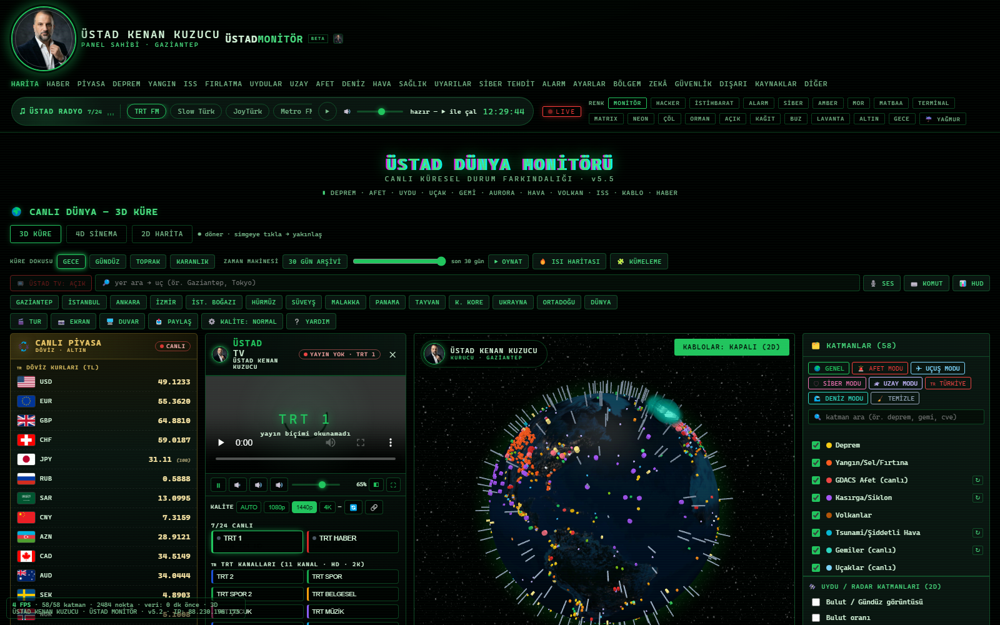

# 🌍 ÜSTAD DÜNYA MONİTÖRÜ

> **23 sekmeli kişisel dünya monitörü** — dünya haritası, canlı piyasa, televizyon, radyo,
> IPTV kanal merkezi, deprem/yangın/uydu/uzay/afet takibi ve **şifreli kasalar**.
> Tek klasörde çalışır, kendi bilgisayarında açılır.



Kenan Kuzucu · Gaziantep

---

## 🧭 Sekmeler (23)

| Grup | Sekmeler |
|---|---|
| 🌐 **Dünya** | **HARİTA** · HABER · **CANLI PİYASA** · DEPREM · YANGIN · İSS · FIRLATMA · UYDULAR · UZAY · AFET · DENİZ · HAVA |
| 🩺 **Kişisel** | SAĞLIK · UYARI · TEHDİT · ALARM · AYARLAR · BÖLGEM |
| 🧠 **Zekâ & Güvenlik** | ZEKÂ · GÜVENLİK · DIŞARI (dünya kameraları) · KAYNAKLAR · **DİĞER (IPTV + 4 kasa)** |

**Üst şeritte:** ÜSTAD TV kutusu (TRT 13 kanal) · **7/24 ÜSTAD RADYO** kutusu (sekme değişse de susmaz) ·
CANLI PİYASA kutusu (32 döviz + altın, bayraklı, 60 sn tazeleme) · 19 renk teması · YAĞMUR efekti.

---

## 🔐 Şifreli kasalar (4 kapı)

| Kasa | İçerik |
|---|---|
| 🔗 **ÖZEL BAĞLANTILAR KASASI** | IPTV/medya bağlantıları · kendi oynatıcısı · 10 düğme |
| 📁 **BELGE KASASI** | Dosya arşivi — resim/video/belge/müzik otomatik klasörlenir, sürükle-bırak |
| 🔑 **ŞİFRE KASASI** | Site/kullanıcı/şifre kayıtları · 20 karakter üretici |
| 📚 **EĞİTİM KASASI** | KALİ REHBERİM içeriği (29 bölüm / 2.468 kayıt) · çözülebilir bilgi testi · okuma takibi |

Şifreleme **tarayıcının içinde** yapılır: **AES-256-GCM** · anahtar **PBKDF2-HMAC-SHA256,
600.000 tur** · rastgele tuz + her yazmada taze IV. Şifre hiçbir yere gönderilmez ve saklanmaz —
unutulursa kurtarılamaz (isteğe bağlı **25 karakterlik kurtarma kodu** üretilebilir).
Kasa kilitliyken içerik DOM'da bile durmaz. 5 dakika hareketsizlikte otomatik kilit.

---

## 🚀 Nasıl çalıştırılır

Masaya kurulu iki başlatıcı:

- `USTAD-MONITOR-YEREL.bat` → `http://localhost:8878` — **tavsiye edilen** (dosyadan içerik aktarma çalışır)
- `USTAD-MONITOR-UCAKLI.bat` → `file://` + özel Chrome profili

Diğer yardımcılar: PANEL-API · PORT-TARA · RTLSDR · TELEGRAM-BOT · BÜLTEN-MAİL · SİTE-YAYINLA · GIT-KAYDET.

> ⚠️ Her iki başlatıcı **ayrı tarayıcı deposu** kullanır: bir modda kurduğun kasalar öbür modda boş görünür.

---

## 🗂️ Dosya düzeni

```
├─ index.html        panel düzeni + 23 sekme + CSS
├─ giris.js          giriş animasyonu ve kapı
├─ kaynak2.js        veri kaynakları (kur, piyasa, uydu, hava...)
├─ katman*.js        harita katmanları · kablolar.js (denizaltı kabloları)
├─ ustadtv.js        ÜSTAD TV · radyo-kutu.js (7/24 radyo) · piyasa-kutu.js
├─ iptv.js           IPTV KANAL MERKEZİ (m3u liste çözme, HLS oynatma)
├─ iptv-kasa.js      bağlantı kasası (AES-256-GCM)
├─ kasa.js           belge · şifre · eğitim kasaları
├─ zeka2.js/analiz.js/komuta.js/disari.js/guvenlik.js ...  sekme modülleri
├─ panel-api.py · mail-gonder.py · telegram-bot.py · port-tara.ps1   yardımcı araçlar
└─ *.bat             tek tıkla başlatıcılar
```

---

## ⚖️ Notlar

- Yalnız **savunma/izleme** amaçlıdır; kişisel kullanım paneli.
- Ayar dosyalarındaki (`mail-ayar.txt`, `bot-ayar.txt`) değerler **örnek/şablon**tur; kendi bilgilerini sen doldurursun.
- İçerik ve panelin tamamı **Kenan Kuzucu**'ya aittir.
